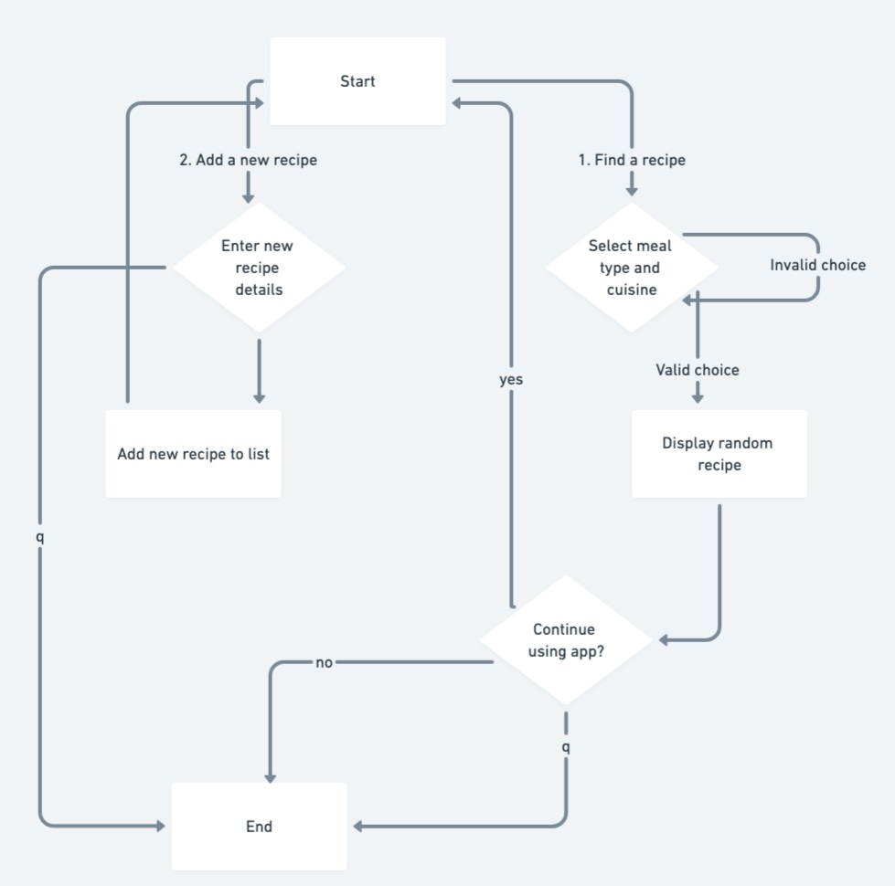
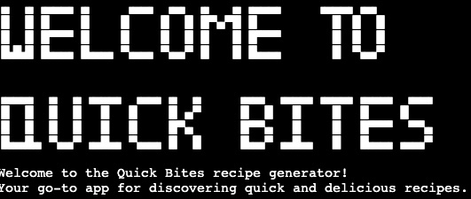
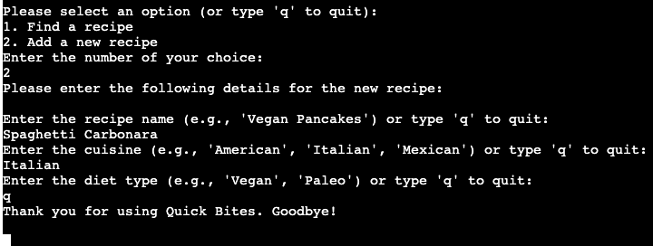

# Quick Bites

## Delicious recipes, just a click away!

(Developer: Alexander Strauch)

## **[Live site](https://quick-bites-3b3835910d4b.herokuapp.com/)**

## Table of contents

1. [Introduction](#introduction)
   - [Project description](#project-description)
   - [Purpose](#purpose)
2. [UX](#ux)
   - [User demographic](#user-demographic)
   - [User goals](#user-goals)
   - [User expectations](#user-expectations)
   - [User stories](#user-stories)
3. [Design](#design)
4. [Features](#features)
   - [Find a recipe](#find-a-recipe)
   - [Add a recipe](#add-a-recipe)
5. [Future features](#future-features)
6. [Languages](#languages)
7. [Technologies](#technologies)
8. [Libraries](#libraries)
9. [Testing](#testing)
   - [Python validation](#python-validation)
10. [Bugs](#bugs)
11. [Deployment](#deployment)
12. [Credits](#credits)
13. [Acknowledgements](#acknowledgements)

## Introduction

### Project description

- The Quick Bites recipe generator is ideal for anyone looking to simplify their cooking experience, from novice cooks to seasoned chefs. It’s perfect for individuals who want to explore new cuisines, save their favorite recipes, and create meal plans without the hassle of browsing through endless websites or cookbooks.

### Purpose

- The intent of the Quick Bites recipe generator is to simplify meal planning and cooking by providing users with easy access to a variety of recipes based on their preferences. It empowers users to discover new dishes and store their own favorite recipes in a user-friendly command-line interface.

[Back to table of contents](#table-of-contents)

## UX

### User demographic

- This project is intended for anyone who wants a convenient way to manage recipes and enhance their cooking experience, regardless of their culinary skill level.

### User goals

- Discover new recipes

- Simplify meal planning

- Save and organize recipes

- Experiment with different cuisines

- Add personalized recipes

### User expectations

- A simple and easy to use command-line interface with clear instructions

- Ability to quickly find and retrieve recipes based on their preferences

- Customization for adding personal recipes 

- Expectation that added recipes will be securely saved

- Effective filtering of recipes by meal type, cuisine or diet without irrelevant results

- Proper handling of errors, such as invalid inputs, with clear feedback

### User stories

#### User

- As a student, I want to filter recipes by meal type and dietary restrictions so I can find budget-friendly meals that fit my dietary needs.

- As a home cook, I want to add and store my own family recipes in the app so I can access them easily whenever I need them.

- As a busy professional, I want to quickly find a recipe for dinner based on a specific cuisine so I can cook a meal without spending too much time searching.

- As a health-conscious individual, I want to explore vegan or gluten-free recipes for breakfast so I can plan my meals according to my diet.

- As a culinary enthusiast, I want to get random recipe suggestions based on different cuisines so I can experiment with new flavors and techniques.

#### Site owner

- As the site owner, I want to provide users with an easy-to-use interface so they can quickly find, add, and save recipes without confusion or frustration.

- As the site owner, I want to implement a robust filtering system so users can efficiently search recipes based on meal type, cuisine, and dietary preferences.

- As the site owner, I want to include comprehensive error handling so users receive helpful feedback when encountering issues, such as invalid input or missing files.

- As the site owner, I want to allow users to contribute their own recipes easily so the recipe database grows organically and reflects diverse user tastes.

- As the site owner, I want to ensure that user-added recipes are stored securely and persistently, so users can access their data across multiple sessions.

[Back to table of contents](#table-of-contents)

## Design

ASCII art for logo (click me)

Flowchart (click me)

[Back to table of contents](#table-of-contents)

## Features

### Find a recipe

Logo with slogan (click me)

Printed above the menu options.

Main menu (click me)

Displays all options for the user at the start of the app.

Meal type option (click me)

Displays all meal type options for the user.

Breakfast option (click me)

Displays all breakfast options for the user.

American breakfast option (click me)

Displays the chosen recipe with ingredients and instructions.

Continuation option (click me)

Asks user if he is still hungry. User chooses yes and the app loop starts again.

No option (click me)

Asks user if he is still hungry. User chooses no, receives a goodbye message and exits the app.

Quit option at end (click me)

Asks user if he is still hungry. User quits, receives a goodbye message and exits the app.

Quit option after meal type presentation (click me)

User chooses quit option, receives goodbye message and exits the app.

Quit option after cuisine presentation (click me)

User chooses quit option, receives goodbye message and exits the app.

### Add a recipe

Add a new recipe option & enter recipe name (click me)

User chooses to add a new recipe and is prompted to enter the recipe name or quit the app.

Enter cuisine name (click me)

User gives his recipe a name and is prompted to enter the cuisine or quit the app.

Enter diet type (click me)

User enters the cuisine and is prompted to enter the diet type or quit the app.

Enter meal type (click me)

User enters the diet type and is prompted to enter the meal type or quit the app.

Enter ingredients (click me)

User enters the meal type and is prompted to enter the ingredients or quit the app.

Enter instructions (click me)

User enters the ingredients and is prompted to enter the instructions or quit the app.

Recipe successfully added (click me)

User enters the instructions, receives a message that the recipe was successfully added and is brought back to the start of the app. Here he has the option to find a recipe, add a new recipe or quit the app.

Added recipe found (click me)

User types his way through 

Quit option after recipe name (click me)

User chooses quit option, receives goodbye message and exits the app.

Quit option after cuisine (click me)

User chooses quit option, receives goodbye message and exits the app.

Quit option after diet type (click me)

User chooses quit option, receives goodbye message and exits the app.

Quit option after meal type (click me)

User chooses quit option, receives goodbye message and exits the app.

Quit option after ingredients (click me)

User chooses quit option, receives goodbye message and exits the app.

Quit option after instructions (click me)

User chooses quit option, receives goodbye message and exits the app.

[Back to table of contents](#table-of-contents)

## Future features

- add more recipes

- style the CLI different, add color to the text output and a fitting background image

- add option to print recipe from terminal

[Back to table of contents](#table-of-contents)

## Languages

- Python

[Back to table of contents](#table-of-contents)

## Technologies

- GitHub for the repository

- Gitpod as the code editor

- git for version control and pushing the code to GitHub

- Heroku for deploying the project

- CI Python Linter

- Affinity designer for flowchart

[Back to table of contents](#table-of-contents)

## Libraries

- json to load recipes & save new recipes

[Back to table of contents](#table-of-contents)

## Testing

### Quick Bites recipe generator test results

| Test description                                   | Expected result                                                                 | Actual result                    | Status    |
| ---------------------------------------------------| ------------------------------------------------------------------------------- | -------------------------------- | --------- |
| Load valid recipe file                             | Recipes should be loaded into the app from `recipes.json`.                      | Recipes loaded successfully.     | Pass      |
| Load non-existent recipe file                      | App should show an error message indicating the file is not found.              | Error message displayed.         | Pass      |
| Add new recipe                                     | Recipe should be added and saved to the `recipes.json` file.                    | Recipe added successfully.       | Pass      |
| Get filtered recipes by meal type and cuisine      | Should return a list of recipes matching the specified meal and cuisine.        | List of recipes returned.        | Pass      |
| Get random recipe (existing meal type and cuisine) | A random recipe matching the criteria should be displayed.                      | Recipe displayed.                | Pass      |
| Get random recipe (non-existent meal type/cuisine) | App should display a message indicating no recipe found.                        | No recipe found message.         | Pass      |
| Display recipe                                     | Displays recipe details correctly if found, otherwise shows a not found message.| Recipe details displayed.        | Pass      |
| User quits the app                                 | The app should close with a farewell message.                                   | App closed successfully.         | Pass      |
| Invalid input for meal type                        | App should prompt user again for valid input.                                   | Prompted for valid input.        | Pass      |
| Invalid input for cuisine                          | App should prompt user again for valid input.                                   | Prompted for valid input.        | Pass      |
| Add recipe with multiple ingredients               | Ingredients should be parsed and saved correctly.                               | Ingredients saved correctly.     | Pass      |
| Add recipe with instructions                       | Instructions should be added and saved to the recipe.                           | Instructions saved successfully. | Pass      |
| Save recipes                                       | Recipes should be correctly saved to `recipes.json`.                            | Recipes saved correctly.         | Pass      |
| Get random recipe after adding new recipe          | Should still be able to get random recipe including the newly added recipe.     | Random recipe displayed.         | Pass      |
| Handle empty recipe list                           | If no recipes exist, should return appropriate message when fetching recipes.   | No recipes message displayed.    | Pass      |
| Repeatedly add recipes and save                    | Adding multiple recipes in sequence should maintain correct order and format.   | All recipes added and saved.     | Pass      |
| Load recipes after adding new one                  | Ensure recipes are loaded correctly after adding a new one.                     | All recipes loaded correctly.    | Pass      |

### Python validation

Validation with CI Python Linter (click me)

No errors found.

[Back to table of contents](#table-of-contents)

## Bugs

| Bug                                                                                |Fix                                         |
| -----------------------------------------------------------------------------------|--------------------------------------------|
| When adding a new recipe there is an empty line above the input for the diet type  | Delete an example from the diet type input |
| ASCII art for Quick Bites logo is too big for CLI                                  | Use different & smaller font for logo      |

[Back to table of contents](#table-of-contents)

## Deployment

1.	Run the command pip3 freeze > requirements.txt in the terminal, then commit and push the changes to GitHub.
2.	Log in to your Heroku account or sign up if you don’t have one.
3.	In the top right corner, click the “New” button and choose “Create new app”.
4.	Pick a name for your app, select your region, and click “Create app”.
5.	Navigate to the “Settings” tab, then go to Config Vars and click “Reveal Config Vars”.
6.	Add a Config Var with KEY = “PORT” and VALUE = “8000”.
7.	Under Buildpacks, add Python (make sure it’s at the top) and Node.js beneath it.
8.	Go to the “Deploy” section, select GitHub as the deployment method, and click “Connect to GitHub”.
9.	Search for and connect the appropriate repository.
10. Under "Manual deploy" click on "Deploy Branch".
11. Once the app is built, click the “View” link to access it.

[Back to table of contents](#table-of-contents)

## Credits

- [Text to ASCII art generator](https://patorjk.com/software/taag/#p=display&f=Graffiti&t=Type%20Something%20) by Patrick Gillespie, used for the Quick Bites Logo

- [json dump in Python](https://www.geeksforgeeks.org/json-dump-in-python/) from Geeks for Geeks

- [How to use the json module in Python](https://www.freecodecamp.org/news/how-to-use-the-json-module-in-python/) from freeCodeCamp

- [isdigit() method in Python](https://www.geeksforgeeks.org/python-string-isdigit-method/) from Geeks for Geeks

- [Using Python's enumerate()](https://realpython.com/python-enumerate/) from Real Python

[Back to table of contents](#table-of-contents)

## Acknowledgements

I would like to thank my mentor Gareth McGirr for his useful tips and keen insight.

[Back to table of contents](#table-of-contents)
