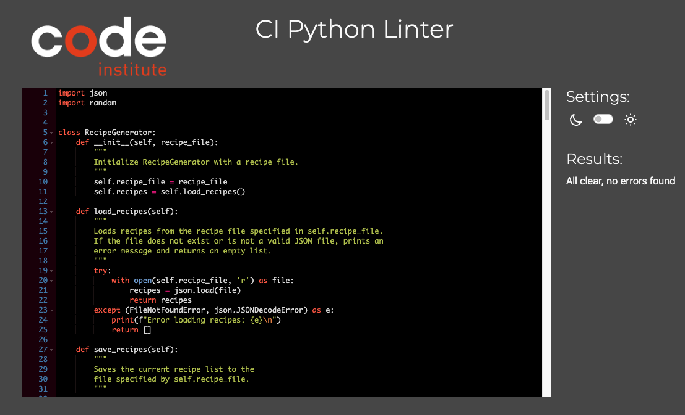

# Quick Bites

## Delicious recipes, just a click away!

(Developer: Alexander Strauch)

## **[Live site](https://quick-bites-3b3835910d4b.herokuapp.com/)**

## Table of contents

1. [Introduction](#introduction)
   - [Project description](#project-description)
   - [Purpose](#purpose)
2. [UX](#ux)
   - [User demographic](#user-demo)
   - [User goals](#user-goals)
   - [User expectations](#user-expectations)
   - [User stories](#user-stories)
3. [Design](#design)
   - [Design choices](#design-choices)
   - [Colors](#colors)
   - [Layout](#layout)
4. [Features](#features)
5. [Future features](#future-features)
6. [Languages](#languages)
7. [Technologies](#technologies)
8. [Testing](#testing)
   - [Python validation](#python-validation)
9. [Bugs](#bugs)
10. [Deployment](#deployment)
11. [Credits](#credits)
12. [Acknowledgements](#acknowledgements)

## Introduction

### Project description

- The Quick Bites recipe generator is ideal for anyone looking to simplify their cooking experience, from novice cooks to seasoned chefs. It’s perfect for individuals who want to explore new cuisines, save their favorite recipes, and create meal plans without the hassle of browsing through endless websites or cookbooks.

### Purpose

- The intent of the Quick Bites recipe generator is to simplify meal planning and cooking by providing users with easy access to a variety of recipes based on their preferences. It empowers users to discover new dishes and store their own favorite recipes in a user-friendly command-line interface.

[Back to table of contents](#table-of-contents)

## UX

### User demographic

- This project is intended for anyone who wants a convenient way to manage recipes and enhance their cooking experience, regardless of their culinary skill level.

### User goals

- Discover new recipes

- Simplify meal planning

- Save and organize recipes

- Experiment with different cuisines

- Add personalized recipes

### User expectations

- A simple and easy to use command-line interface with clear instructions

- Ability to quickly find and retrieve recipes based on their preferences

- Customization for adding personal recipes 

- Expectation that added recipes will be securely saved

- Effective filtering of recipes by meal type, cuisine or diet without irrelevant results

- Proper handling of errors, such as invalid inputs, with clear feedback

### User stories

#### User

- As a student, I want to filter recipes by meal type and dietary restrictions so I can find budget-friendly meals that fit my dietary needs.

- As a home cook, I want to add and store my own family recipes in the app so I can access them easily whenever I need them.

- As a busy professional, I want to quickly find a recipe for dinner based on a specific cuisine so I can cook a meal without spending too much time searching.

- As a health-conscious individual, I want to explore vegan or gluten-free recipes for breakfast so I can plan my meals according to my diet.

- As a culinary enthusiast, I want to get random recipe suggestions based on different cuisines so I can experiment with new flavors and techniques.

#### Site owner

- As the site owner, I want to provide users with an easy-to-use interface so they can quickly find, add, and save recipes without confusion or frustration.

- As the site owner, I want to implement a robust filtering system so users can efficiently search recipes based on meal type, cuisine, and dietary preferences.

- As the site owner, I want to include comprehensive error handling so users receive helpful feedback when encountering issues, such as invalid input or missing files.

- As the site owner, I want to allow users to contribute their own recipes easily so the recipe database grows organically and reflects diverse user tastes.

- As the site owner, I want to ensure that user-added recipes are stored securely and persistently, so users can access their data across multiple sessions.

[Back to table of contents](#table-of-contents)

## Design

ASCII art for logo (click me)

[Back to table of contents](#table-of-contents)

## Features

[Back to table of contents](#table-of-contents)

## Future features

- add more recipes

- style the CLI different, add color to the text output and a fitting background image

- add option to print recipe from terminal

[Back to table of contents](#table-of-contents)

## Languages

- Python

[Back to table of contents](#table-of-contents)

## Technologies

- GitHub for the repository

- Gitpod as the code editor

- git for version control and pushing the code to GitHub

- Heroku for deploying the project

- CI Python Linter

[Back to table of contents](#table-of-contents)

## Testing

### Python validation

Validation with CI Python Linter (click me)

No errors found.

[Back to table of contents](#table-of-contents)

## Bugs

| Bug                                                                                |Fix                                         |
| -----------------------------------------------------------------------------------|--------------------------------------------|
| When adding a new recipe there is an empty line above the input for the diet type  | Delete an example from the diet type input |
| ASCII art for Quick Bites logo is too big for CLI                                  | Use different & smaller font for logo      |

[Back to table of contents](#table-of-contents)

## Deployment

[Back to table of contents](#table-of-contents)

## Credits

- [Text to ASCII art generator](https://patorjk.com/software/taag/#p=display&f=Graffiti&t=Type%20Something%20) by Patrick Gillespie, used for the Quick Bites Logo

- [json dump in Python](https://www.geeksforgeeks.org/json-dump-in-python/) from Geeks for Geeks

- [How to use the json module in Python](https://www.freecodecamp.org/news/how-to-use-the-json-module-in-python/) from freeCodeCamp

- [isdigit() method in Python](https://www.geeksforgeeks.org/python-string-isdigit-method/) from Geeks for Geeks

- [Using Python's enumerate()](https://realpython.com/python-enumerate/) from Real Python

[Back to table of contents](#table-of-contents)

## Acknowledgements

I would like to thank my mentor Gareth McGirr for his useful tips and keen insight.

[Back to table of contents](#table-of-contents)
